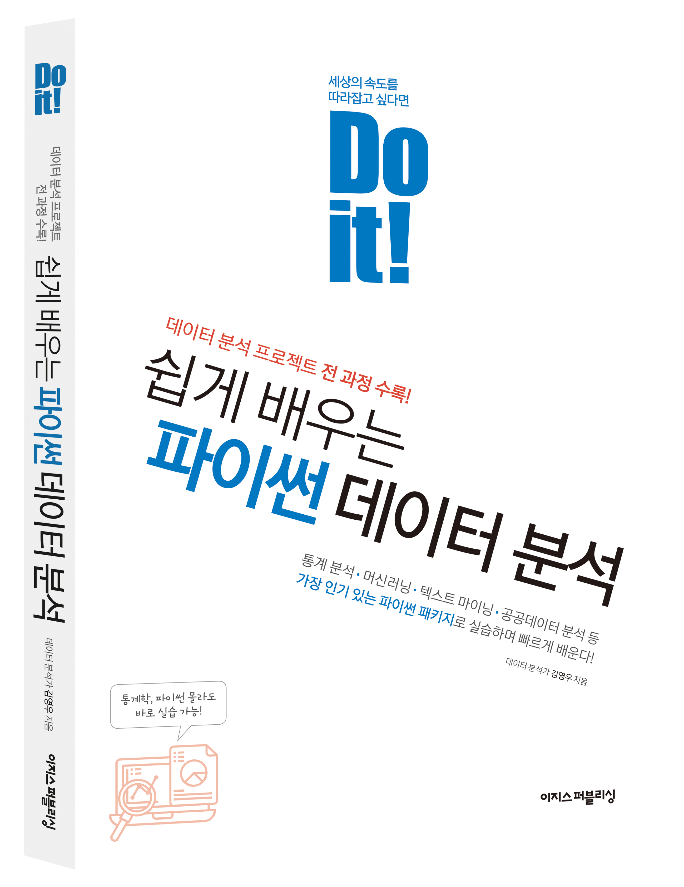

<Do it! 쉽게 배우는 파이썬 데이터 분석> 저장소
---

- 예스24 [[바로가기]](http://www.yes24.com/Product/Goods/108947478)
- 알라딘 [[바로가기]](https://www.aladin.co.kr/shop/wproduct.aspx?ItemId=293059248)
- 교보문고 [[바로가기]](http://www.kyobobook.co.kr/product/detailViewKor.laf?mallGb=KOR&ejkGb=KOR&barcode=9791163033493)

---

폴더           | 내용
:------------- |:-------------
[Data](https://github.com/youngwoos/Doit_Python/tree/main/Data) | 실습 데이터 파일
[Notebook](https://github.com/youngwoos/Doit_Python/tree/main/Notebook) | 주피터 노트북, 퀴즈 정답
[docs](https://github.com/youngwoos/Doit_Python/tree/main/docs) | 강의용 프리젠테이션 자료

- 저장소의 모든 자료를 한 번에 다운로드하려면 다음 [링크](https://github.com/youngwoos/Doit_Python/archive/refs/heads/main.zip)를 클릭하세요.

---

## 질문하기
궁금한 점이 있으면 페이스북 [데이터 분석 커뮤니티](https://www.facebook.com/groups/datacommunity)에 질문을 올려 주세요. 데이터 분석을 공부하는 사람들과 질문과 답변을 주고받으며 함께 공부할 수 있습니다. 질문할 때 작성한 코드나 캡처 이미지를 함께 올려 주시면 답변하는 데 도움이 됩니다.
